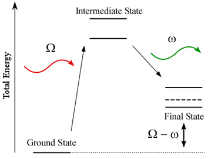
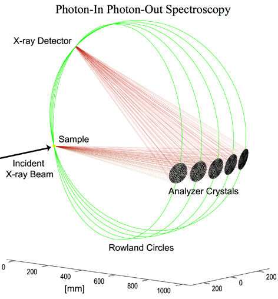

.. Related Techniques

Related Techniques
-------------------

There are a number of X-ray techniques that are related to or share some
characteristics with X-ray absorption spectroscopy.  Most of these
involve the excitation of core electronic levels or are sensitive to the
chemical state or local atomic coordination around a particular element
selected by an X-ray absorption edge or emission line.

X-Ray Emission Spectroscopy
~~~~~~~~~~~~~~~~~~~~~~~~~~~~~~~~

There are various experimental schemes for detecting X-rays that are
emitted from a sample. We take the liberty within this wiki to define X-ray
Emission Spectroscopy (XES) as measuring the X-rays with an energy lower
than the excitation energy, e.g. inelastically scattered, and with an
instrumental energy broadening that is on the order of the core hole
lifetime broadening. This article only discusses hard X-ray XES. The 1s
core hole lifetime broadening of 3d transition metals is around 1 eV and
increases to several eV for the L lines of 5d elements[1].

XES is a secondary process. First, a core hole is created by, e.g., the
absorption of an incident photon. The core hole decays after a time
:math:`\tau` (the core hole lifetime) and the energy that is freed upon
this decay is either transferred to an electron (Auger decay) or to a
photon (XES). With a tunable incident energy we can distinguish between
resonant and non-resonant XES. The latter is usually referred to as X-ray
fluorescence. When the incident energy is tuned around the resonances of an
absorption edge we can observe a variation of the XES spectral shape
depending on the incident energy. Resonant XES can be described within the
theoretical framework of resonant inelastic X-ray scattering (RIXS). XES,
RXES and RIXS have been reviewed by several authors.[2-5]

The intermediate states in the image below are the excited states that give rise to an X-ray absorption spectrum.

   Intermediate and Final Electronic States

XES with lifetime resolution is sensitive to the local electronic structure and coordination of the emitting atom. It provides information that is complementary to XAS in particular with respect to electronic structure.

XES in combination with XAS at a synchrotron radiation beamline is a photon-in photon-out technique. The hard X-ray probe makes all techniques suitable for in-situ (operando) studies and experiments under extreme conditions (e.g. high pressure). XAS-XES can be performed within the same experimental setup.

.. rubric:: Instrumentation

Solid state detectors with an energy bandwidth > 150 eV for the Kalpha emission lines of the 3d transition metals cannot be used for X-ray emission spectroscopy with lifetime resolution. Bragg optics using a perfect single crystal monochromator (like the beamline monochromator for the incident energy) can achieve the required energy resolution. Several geometrical schemes to realize such a secondary spectroscopy have been thought off and implemented at synchrotron radiation sources as well as laboratory X-ray and/or particle sources (e.g. protons):

- Johann

- Johansson

- van Howe

The geometries are based on the Rowland circle. In Johann and Johansson geometry the diameter of the Rowland circle is defined by a spherically bent analyzer crystal. Sample, crystal and detector and moved along this Rowland to change the Bragg angle and thus to perform and energy scan.

   Sample, Analyzer, and Detectors for X-ray emission spectroscopy

.. rubric:: Selected References

[1] J.C. Fuggle and J.E. Inglesfield, eds. Unoccupied Electronic States. Topics in Applied Physics. Vol. 69. 1992, Springer-Verlag: Berlin.

[2] F.M.F. de Groot, High-Resolution X-ray Emission and X-ray Absorption Spectroscopy. Chem. Rev., 2001. 101: p. 1779-1808.

[3] F.M.F. de Groot, Multiplet effects in X-ray spectroscopy. Coordination Chemistry Reviews, 2005. 249(1-2): p. 31-63.

[4] P. Glatzel and U. Bergmann, High resolution 1s core hole x-ray spectroscopy in 3d transition metal complexes - Electronic and structural information. Coordination Chemistry Reviews, 2005. 249: p. 65-95.

[5] F.M.F. de Groot and A. Kotani, Core Level Spectroscopy of Solids. Taylor and Francis, New York (2008)

[6] A. Meisel, G. Leonhardt, and R. Szargan. X-ray Spectra and Chemnical Binding, Chemical Physics Vol 37. Springer Verlag, 1989

[7] W. Schülke, Electron Dynamics by Inelastic X-Ray Scattering (Oxford University Press, Oxford, 2007)

[8] J. Hoszowska, et al., Nucl. Instr. and Meth. A 376, 129 (1996)

[9] K. Sakurai and H. Eba, Jpn. J. Appl. Phys. Part 1 38, 650 (1999)

[10] U. Bergmann and S. P. Cramer, in Crystal and Multilayer Optics (SPIE, San Diego, 1998), Vol. 3448, p. 198

[11] H. Hayashi, et al., J. Electron Spec. Rel. Phen. 136, 191 (2004)

[12] E. Welter, et al., J. Synch. Rad. 12, 448 (2005)

[13] S. Huotari, et al., Rev. Sci. Instrum. 77 (2006)

[14] A. C. Hudson, et al., Rev. Sci. Instrum. 78 (2007)

[15] J. P. Hill, et al., J. Synch. Rad. 14, 361 (2007)

Resonant Inelastic X-ray scattering (RIXS)
~~~~~~~~~~~~~~~~~~~~~~~~~~~~~~~~~~~~~~~~~~~~~~~~~

The electronic states that give rise to the edge of an absorption spectrum
are resonantly excited states that subsequently decay. The energy that is
released in the decay process can be carried either by an electron that is
promoted into the continuum (resonant Auger effect) or by a photon. A
radiative decay after resonant excitation is in the literature referred to
as resonant inelastic X-ray scattering (RIXS), resonant X-ray emission
(RXES)or resonant X-ray Raman spectroscopy (RXRS). The combination of
resonant excitation with emission detection bears some interesting physical
phenomena such as interference effects, line narrowing and Raman-Stokes
line shifts.[1-2]

RIXS can be used to study electronic excitations at energies much lower
than the incident hard X-ray energy. This is due to the fact that the
energy transfer - defined as the difference between incident and emitted
energy - describes the electronic excitations. The energy transfer is
equivalent to the final state energy of the excited electron
configuration. It can be as low as a few meV or as high as several keV. In
the former, the spectroscopy is sensitive to phonon excitations, very weak
electron-electron or collective excitations. Final state energies of a few
eV lie in an energy range that is equivalent to optical excitations
directly probing the valence orbitals (but element-selectively). Higher
final state energies of more the a few tens of eV contain a core hole in
the final state.

.. rubric:: Selected References

[1] A. Kotani and S. Shin, Resonant inelastic X-ray scattering spectra for
electrons in solids. Reviews of Modern Physics, 2001. 73(1): p. 203-46.

[2] F. Gel'mukhanov and H. Ågren, Resonant X-ray Raman scattering. Physics
Reports-Review Section of Physics Letters, 1999. 312(3-6): p. 91-330.

X-ray Raman Spectroscopy
~~~~~~~~~~~~~~~~~~~~~~~~~~~~~~~~~~~

X-ray Raman scattering (XRS) is non-resonant inelastic scattering of x-rays
from core electrons. It is analogous to Raman scattering, which is a
largely-used tool in optical spectroscopy, with the difference being that
the wavelengths of the exciting photons fall in the x-ray regime and the
corresponding excitations are from deep core electrons.

XRS is an element-specific spectroscopic tool for studying the electronic
structure of matter. In particular, it probes the excited-state density of
states (DOS) of an atomic species in a sample. As explained below, it
allows access to very similar information as x-ray absorption spectroscopy.

XRS is an inelastic x-ray scattering process, in which a high-energy x-ray
photon gives energy to a core electron, exciting it to an unoccupied
state. The process is in principle analogous to x-ray absorption (XAS), but
the energy transfer plays the role of the x-ray photon energy absorbed in
x-ray absorption, exactly as with Raman scattering in optics where
vibrational low-energy excitations can be observed by studying the spectrum
of light scattered from a molecule.

Because the energy (i.e. wavelength) of the probing x-ray can be chosen
freely and is usually in the hard x-ray regime, certain constraints of soft
x-rays in the studies of electronic structure of the material are
overcome. For example, soft x-ray studies may be surface sensitive and they
require a vacuum environment. This makes studies of e.g. many liquids
impossible using soft x-ray absorption. One of the most notable
applications in which x-ray Raman scattering is superior to soft x-ray
absorption is the study of soft x-ray absorption edges in high
pressure. Whereas high-energy x rays may pass through a high-pressure
apparatus like a diamond anvil cell and reach the sample inside the cell,
soft x-rays would be absorbed by the cell itself.

.. rubric:: History

In his report of finding of a new type of scattering, `C. V. Raman
<https://en.wikipedia.org/wiki/C._V._Raman>`_ proposed that a similar
effect should also be found in the x-ray regime. Around the same time,
B. Davis and D. Mitchell reported in 1928 on the fine-structure of the
scattered radiation from graphite and noted that they had lines that seemed
to be in agreement with carbon K shell energy. Several researchers
attempted similar experiments in the late 1920s and early 1930s but the
results could not always be confirmed.

Often the first unambiguous observations of the XRS effect is credited to
K. Das Gupta (reported findings 1959) and Tadasu Suzuki (reported 1964). It
was soon realized that the XRS peak in solids was broadened by solid-state
effects and it appeared as a band, with a shape similar to that of a XAS
spectrum. The potential of the technique was limited until modern
synchrotron light sources became available.

This is due to the very small XRS probability of the incident photons,
requiring radiation with a very high intensity. Today, the XRS technique is
rapidly growing in importance. It can be used to study near-edge x-ray
absorption fine structure (NEXAFS/XANES) as well as extended x-ray
absorption fine structure (EXAFS).

.. rubric:: Brief theory of XRS

XRS belongs to the class of non-resonant inelastic x-ray scattering, which
has a cross section of

.. math::

   \frac{\rm{d}^2\sigma}{\rm{d}\Omega\,\rm{d}\omega} = \left( \frac{\rm{d}\sigma}{\rm{d}\Omega} \right)_{\rm{Th}} S(\bf{q},\omega)

Here, :math:`(\rm{d} \sigma / \rm{d} \Omega )_{\rm Th}` is the
Thomson cross section, which signifies that the scattering is that of
electromagnetic waves from electrons. The physics of the system under study
is contained in the dynamic structure factor :math:`S(\bf{q},\omega)`, which
is a function of momentum transfer :math:`\hbar \bf{q}` and energy transfer
:math:`\hbar\omega`. The dynamic structure factor contains all non-resonant
electronic excitations, including not only the core-electron excitations
observed in XRS but also e.g. plasmons, the collective fluctuations of
valence electrons, and Compton scattering.

In the one-electron approximation, the dynamic structure factor is given by

.. math::

    S(\bf{q},\omega) = \sum_f \Big| \big\langle f \big| \exp(-\rm{i}  \, \bf{q} \cdot \bf{r}) \big| i \big\rangle \Big|^2 \delta (E_i - E_f + \hbar\omega)

where :math:`|i\rangle` and :math:`|f\rangle` mark initial and final states
(with energies :math:`E_i` and :math:`E_f`), and :math:`\bf{r}` is the
electron position.

.. rubric:: Similarity to x-ray absorption

It was shown by Yukio Mizuno and Yoshihiro Ohmura in 1967 that at small
momentum transfers :math:`q = |\bf{q}|` the XRS contribution to the
dynamic structure factor is proportional to the x-ray absorption
spectrum. The main difference is that while the polarization of light
couples to the momentum of the absorbing electron in XAS, in XRS the
momentum of the incident photon couples to the charge of the
electron. Because of this, the momentum transfer direction of XRS plays the
role of photon polarization of XAS.

As can be seen from the expansion of the exponent in the previous expression

.. math::

    \exp(- \rm{i} \, \bf{q} \cdot \bf{r}) = 1 - \rm{i} \, \bf{q} \cdot \bf{r} + (\rm{i} \, \bf{q} \cdot \bf{r})^2/2 + \ldots

at low :math:`\bf{q}` dipolar transitions dominate, resulting in equivalent transitions as in x-ray absorption spectroscopy (the first term of the expansion (unity) does not contribute due to the orthogonality of the initial and final states):

.. math::

    S(\bf{q},\omega) \propto \sum_f \Big| \big\langle f \big| \bf{q} \cdot \bf{r} \big| i \big\rangle \Big|^2 \delta (E_i - E_f + \hbar\omega)

In this low-:math:`q` limit (the dipole limit), the dynamic structure
factor is thus directly proportional to the x-ray absorption cross section
(with :math:`\bf{q}` taking the role of the polarization
:math:`\hat{\epsilon}`). In the case of K-shell XRS (or XAS), the spectra
is proportional to the p-symmetry projected density of empty states
(pDOS). With increasing momentum transfer also monopolar and quadrupolar
transitions begin to contribute, adding weight from sDOS and dDOS to the
XRS spectrum.

.. rubric:: Selected References

W. Schülke. Electron dynamics studied by inelastic x-ray scattering. Oxford University Press, 2007

See also: https://en.wikipedia.org/wiki/X-ray_Raman_scattering

X-ray and Neutron scattering, Pair Distribution Function (PDF)
~~~~~~~~~~~~~~~~~~~~~~~~~~~~~~~~~~~~~~~~~~~~~~~~~~~~~~~~~~~~~~~~~~

The Pair Distribution Function (PDF) method uses neutron or X-ray
scattering to measure the distribution of atom-atom distances in a sample.
Whereas Bragg scattering typically measures only the most intense
diffraction peaks (the Bragg peaks) to determine the long-range order, PDF
measures the total scattering pattern including the diffuse or liquid-like
scattering which is sensitive to all atom-atom correlations.  PDF
measurements are typically done on nano-scale crystallites or highly
disordered materials to obtain information about short-range order.
powdered sample quantitatively.

The PDF gives the probability of finding one atom a given distance away
from another; peak positions therefore correspond to atom-atom mean
separations and peak areas to atom-atom coordinations. Data may be analysed
using 'small box methods', sometimes termed 'real-space Rietveld', or 'big
box' methods such as reverse Monte Carlo (RMC) methods. In the latter, an
ensemble of atoms are moved iteratively until good agrement is obtained
with the total scattering data (in real and/or reciprocal space) and it is
especially powerful for cases of substantial disorder, including amorphous
materials. Further details are given here.

A comparsion of PDF and XAFS methods includes:

  a) PDF is not atom specific, and so contains signals from all atom-atom
     pairs of atoms (the total pair distribution function) whereas EXAFS is
     sensitive only to the atoms surrounding the selected absorbing atom
     (the partial pair distribution function).  Each has advantages and
     lends itself to different application areas.  Note that, as with all
     X-ray scattering methods, it is possible to use resonant scattering
     methods to enhance or isolate the scattering contribution from one
     atomic species with PDF.  Similarly, one can do selected isotopic
     replacement with neutron scattering to isolate the contribution from a
     single atom type.

  b) Like EXAFS, PDF is a quantitativ measure of local structure. Data
     interpretation are robust and the PDF provides an unambiguous function
     for further study.

  c) The typical length scale that can be probed and successfully analyzed
     with PDF is typically longer than for EXAFS.  For EXAFS, unambiguous
     analysis past 5 Angstroms or so is challenging, while PDF can be
     sensitive up to 20 Angstroms or so.

Diffraction Anomalous Fine Structure (DAFS)
~~~~~~~~~~~~~~~~~~~~~~~~~~~~~~~~~~~~~~~~~~~~~~~~~~~~

DAFS is the XAFS-like oscillations observed in the diffracted intensities of Bragg diffraction peaks.

.. rubric:: Selected References

`Diffraction anomalous fine structure: Unifying x-ray diffraction and x-ray
absorption with DAFS <https://docs.xrayabsorption.org/Related_Techniques/DAFS/icas.pdf>`_ L. B. Sorensen,
Julie O. Cross, M. Newville, B. Ravel, J. J. Rehr, H. Stragier,
C. E. Bouldin, and J. C. Woicik. Resonant Anomalous X-Ray Scattering:
Theory and Applications Ed. G. Materlik, C. J. Sparks, and K. Fischer,
North-Holland, pp. 389--420, (1994).

`Analysis of Diffraction Anomalous Fine Structure  <https://docs.xrayabsorption.org/Related_Techniques/DAFS/jcross_thesis.pdf>`_
Julie Cross's PhD dissertation.

See also: `Diffraction Anomalous Fine Structure (DAFS) <https://cars9.uchicago.edu/~newville/dafs/>`_

Electron-Energy Loss Spectroscopy
~~~~~~~~~~~~~~~~~~~~~~~~~~~~~~~~~~~~~

X-ray Magnetic Circular Dichroism
~~~~~~~~~~~~~~~~~~~~~~~~~~~~~~~~~~~~
